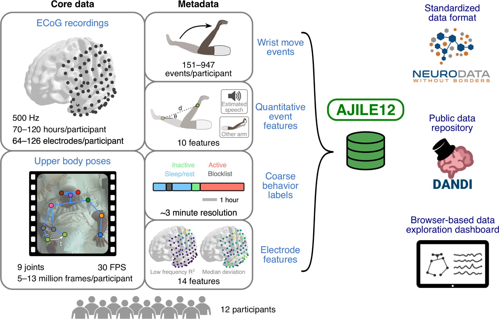
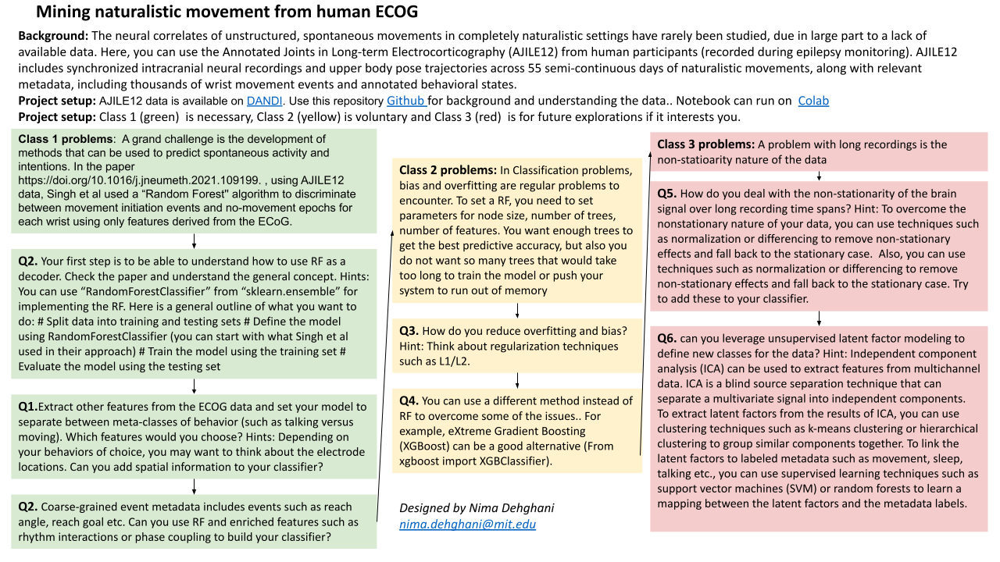

# Neuromatch-AJILE12

Package for exploratory analysis of long-term naturalistic human intracranial neural recordings and pose
([dataset link](https://doi.org/10.48324/dandi.000055/0.220127.0436)).

Includes code to plot figures from [data descriptor paper](https://www.nature.com/articles/s41597-022-01280-y). 
*AJILE12: Long-term naturalistic human intracranial neural recordings and pose. Sci Data 9, 184 (2022).* https://doi.org/10.1038/s41597-022-01280-y

Run the  to see more details on the scientific background, data handling and some exploratory analysis routines.

The notebook (adapted/modified/extended from code by CatalystNeuro and original implementation by Steve Peterson [eNeuro paper](https://www.eneuro.org/content/8/3/ENEURO.0007-21.2021)) is designed as a guide for project template for [Computational Neurosciecne Course](https://compneuro.neuromatch.io/) of [Neuromatch Academy](https://academy.neuromatch.io/). For details about the project, see:

This is released under MIT license. Feel free to use for research or educational material.