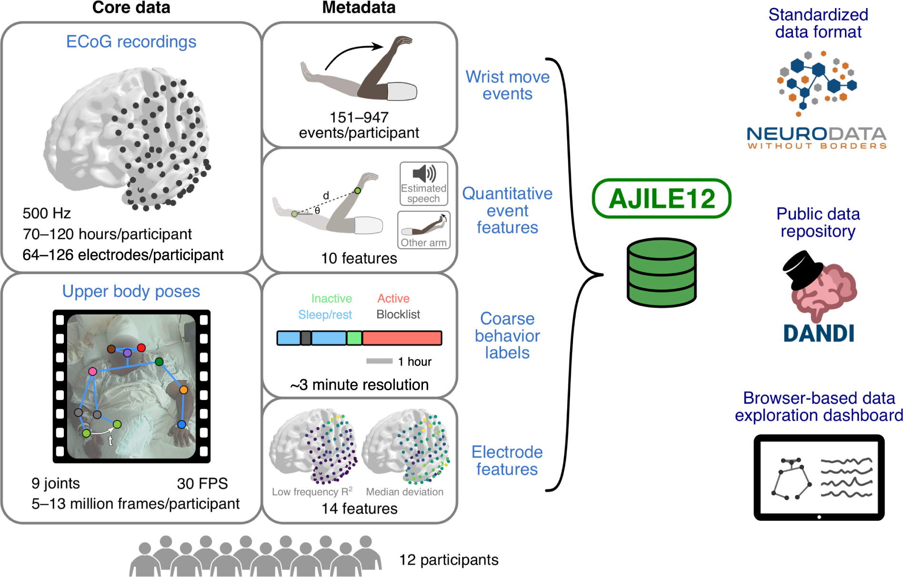

# Neuromatch-AJILE12
Package for exploratory analysis of long-term naturalistic human intracranial neural recordings and pose
([dataset link](https://doi.org/10.48324/dandi.000055/0.220127.0436)).
Includes code to plot figures from [data descriptor paper](https://doi.org/10.1101/2021.07.26.453884).

Run the  to see more details.